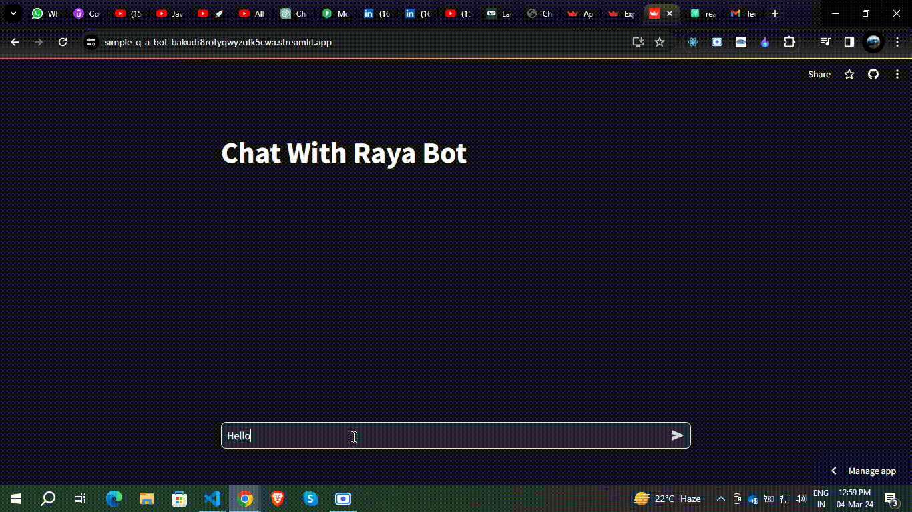

# Simple Q/A Bot using Open AI with streaming feature.

This application is able to answer your questions. I used Open AI key to build this.

## you can see this application in action below.



## Clone this repo to use this project.


## To Start configration this application you need to make virtual environment.

`virtualenv env_name`

## Activate virtual environment

```bash
# for linux
Source env/bin/activate
```

```bash
# for windows
env\Scripts\activate
```

## Install all the Required packages.

```bash
pip install -r requirements.txt
```

## Create a .env file and add your OPENAI_API_KEY.
```bash
OPENAI_API_KEY = "your key"
```

## Run the application
```bash
streamlit run app.py
```


